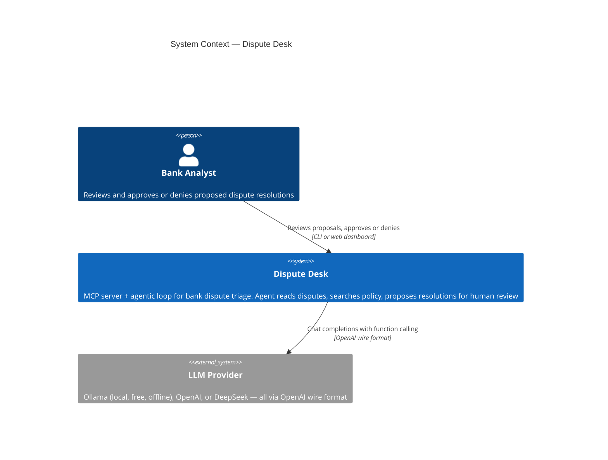
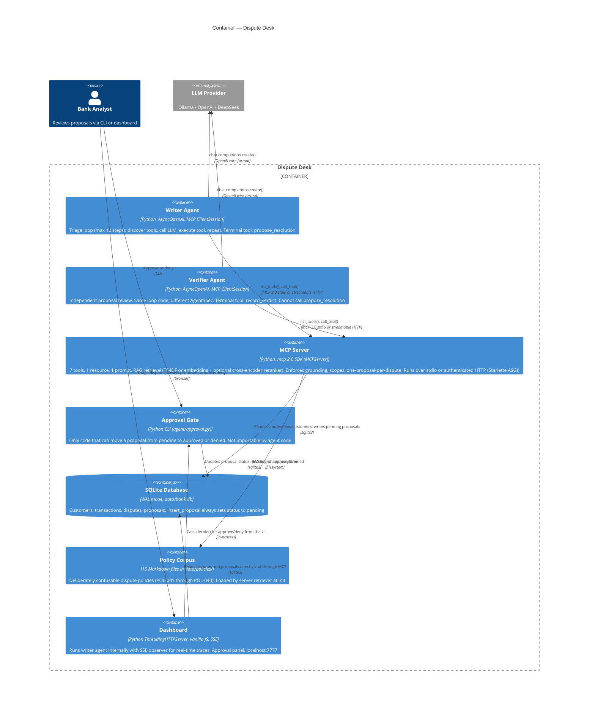
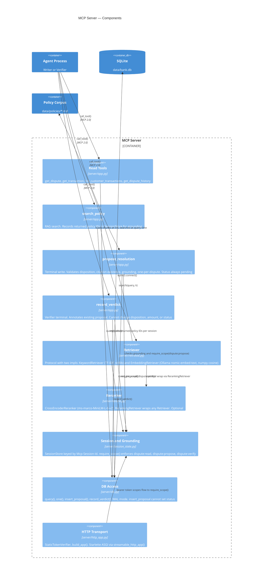
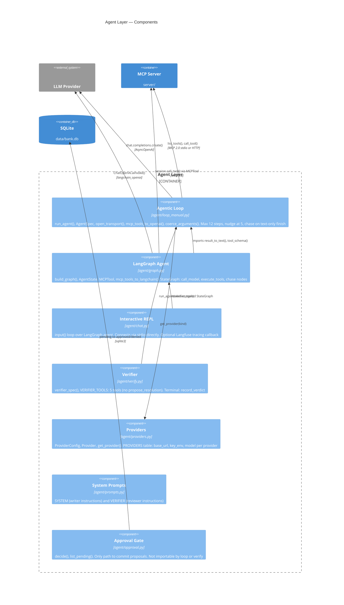

# Dispute Desk

MCP server + agentic loop for bank dispute triage. Two agent implementations
(hand-written loop and LangGraph), a RAG pipeline with two retrievers and a
cross-encoder reranker, a 30-case eval suite with deterministic and LLM-as-judge
metrics, and a reranker fine-tuning pipeline.

Runs **free and offline** against a local model. No API key required for core paths.

---

## Architecture

```
   ┌──────────────┐                      ┌────────────────┐
   │   LLM        │                      │   MCP SERVER   │
   │ (OpenAI /    │                      │  (own process) │
   │  Ollama)     │                      │  tools + data  │
   └──────┬───────┘                      └───────▲────────┘
          │                                      │
          │  tool call (text, not execution)      │  tools/list
          │                                      │  tools/call
          ▼                                      │
   ┌─────────────────────────────────────────────┴────────┐
   │              YOUR AGENT  (the MCP client)            │
   │   asks server what tools exist → tells the LLM →     │
   │   receives tool call → executes it on the server →   │
   │   feeds result back to the LLM → loops               │
   └──────────────────────────────────────────────────────┘
```

The model never talks to the MCP server. The agent brokers. `server/` never
imports an LLM SDK — it works identically whether the caller is Ollama, OpenAI,
Claude Desktop, or the MCP Inspector.

### C4 Model

**Level 1 — System Context**



**Level 2 — Containers**

The writer and verifier agents are the same loop code (`run_agent` in
`loop_manual.py`) with different `AgentSpec` configs — different system prompt,
different allowed tools, different terminal tool. The MCP server is always a
separate process (stdio subprocess or ASGI app). The model never contacts it
directly.



The eval suite (`evals/`) and training pipeline (`training/`) are offline
development tools, not runtime containers — they invoke the agent and retriever
in isolation against fresh temp databases.

**Level 3 — MCP Server Components** (`server/`)



**Level 3 — Agent Components** (`agent/`)



**Code Linkage** — file-level import graph

```
server/app.py          → server/db           query(), one()
                       → server/retrieval    get_retriever() → Retriever protocol
                       → server/session_state SessionStore, require_scope(), session_key()

server/http_app.py     → server/app          mcp (MCPServer instance), SCOPE_* constants

server/retrieval.py    → server/rerank       RerankingRetriever (conditional, when RERANK=1)

server/rerank.py       → torch, transformers (lazy load on first score() call)
                       → tls_trust           enables OS cert store for model downloads

server/db.py           (stdlib only — sqlite3, pathlib, os)

server/session_state.py → mcp.server.auth    caller_scopes() reads bearer token (lazy, HTTP only)

agent/loop_manual.py   → agent/prompts       SYSTEM
                       → agent/providers     get_provider(), KINDS
                       → mcp SDK             ClientSession, StdioServerParameters, streamable_http_client

agent/graph.py         → agent/loop_manual   result_to_text(), tool_schema()
                       → langchain_core      BaseTool, message types
                       → langchain_openai    ChatOpenAI
                       → langgraph           StateGraph

agent/chat.py          → agent/graph         build_graph(), mcp_tools_to_langchain(), AgentState
                       → agent/prompts       SYSTEM
                       → agent/providers     KINDS, PROVIDERS, ALIASES (uses own _resolve_provider(), not get_provider())

agent/verify.py        → agent/loop_manual   run_agent(), AgentSpec
                       → agent/prompts       VERIFIER
                       → server/db           reads pending proposals (cross-boundary)

agent/approval.py      → server/db           connect(), query(), one() (cross-boundary)

dashboard.py           → agent/loop_manual   run() — embeds agent with SSE observer callback
                       → agent/approval      decide(), list_pending()
                       → server/db           reads disputes and proposals for the UI
                       → agent/providers     get_provider()
```

Two cross-boundary imports to note: `agent/verify.py` and `agent/approval.py`
both reach into `server/db` to read proposal state. The approval gate writes
status there — the only write path to a committed decision. The agent code
(`loop_manual.py`, `graph.py`) never imports `server/db` or `agent/approval` —
it talks to the database exclusively through MCP tool calls.

---

## Quickstart

```bash
conda activate mcp-poc
python -m data.seed                                            # build the SQLite DB
python -m agent.loop_manual --dispute D-1004 --model qwen2.5:7b  # hand-written loop
python -m agent.chat --dispute D-1004 --provider openai           # LangGraph agent
python -m agent.approval --list                                   # see proposals
```

Inspect the server standalone (no model, no key, no network):

```bash
mcp dev server/app.py
```

---

## What's here

| Path | What it is |
|---|---|
| `server/app.py` | MCP server: 7 tools, 1 resource, 1 prompt |
| `server/http_app.py` | Same server over authenticated HTTP with scope-based access |
| `server/retrieval.py` | `Retriever` protocol, TF-IDF and embedding implementations |
| `server/rerank.py` | Cross-encoder reranker (ms-marco-MiniLM-L-6-v2) |
| `server/session_state.py` | Per-session grounding state + scope enforcement |
| `server/db.py` | SQLite access (stdlib, WAL mode) |
| `agent/loop_manual.py` | **The teaching file.** Hand-written agentic loop |
| `agent/graph.py` | LangGraph implementation of the same agent |
| `agent/chat.py` | Interactive REPL with optional Langfuse tracing |
| `agent/verify.py` | Verifier agent — same loop, different `AgentSpec` |
| `agent/providers.py` | Three providers as a data table (local / openai / deepseek) |
| `agent/approval.py` | Human gate — the only thing that can commit a decision |
| `evals/run_evals.py` | 30-case eval harness with deterministic metrics |
| `evals/deepeval_bridge.py` | LLM-as-judge scoring via DeepEval (optional) |
| `evals/retrieval_eval.py` | Retrieval-only eval (no LLM needed) |
| `evals/verifier_eval.py` | Verifier catch rate / false-reject rate |
| `training/build_pairs.py` | Synthetic training data with hard-negative mining |
| `training/train_rerank.py` | Reranker fine-tune with BCE and listwise loss |
| `data/policies/` | 15 policy docs, deliberately confusable |
| `tests/` | 96 tests, all runnable without a model |

All three MCP primitives are exposed:

- **Tools** — model-controlled (`get_dispute`, `search_policy`, `propose_resolution`, etc.)
- **Resources** — app-controlled (`policy://index`)
- **Prompts** — user-controlled (`triage_dispute`)

---

## Safety design

The agent **cannot move money**. This is structural, not a prompt instruction:

- `propose_resolution` inserts with `status='pending'`. `db.insert_proposal` cannot set status.
- Committing lives in `agent/approval.py`, which the agent never imports.
- A test asserts the server exposes no settle/commit/transfer tool.
- The eval harness checks auto-commits as a **gate** and exits nonzero if any appear.

Grounding is enforced at the tool boundary: `search_policy` records what it
returned per session, `propose_resolution` refuses any citation not in that set.
The system prompt said "never cite a policy you did not read." The model ignored
it. The server enforces it.

Prompt injection case included: transaction T-2021's merchant descriptor contains
adversarial instructions. Measured in the eval suite, not assumed.

---

## Two agents, one loop

```bash
python -m agent.loop_manual --dispute D-1004    # writer: proposes
python -m agent.verify      --dispute D-1004    # verifier: reviews
python -m agent.approval --list                 # human sees both
```

The only difference between the two agents is an `AgentSpec` — a frozen
dataclass with five fields (system prompt, task, allowed tools, terminal tool,
nudge). Same loop, different config. The verifier re-fetches evidence
independently and annotates the proposal rather than gating it.

---

## Retrieval results

`evals/retrieval_eval.py` measures retrieval without an LLM. 30 cases, 15
policy documents / 75 chunks, deliberately confusable corpus.

| Configuration | recall@1 | recall@8 | MRR |
|---|---|---|---|
| TF-IDF baseline | 36.7% | **80.0%** | 0.503 |
| TF-IDF + cross-encoder rerank | **50.0%** | 73.3% | **0.561** |
| Embedding baseline (nomic-embed-text) | **53.3%** | 70.0% | **0.569** |
| Embedding + cross-encoder rerank | 50.0% | 76.7% | 0.562 |

TF-IDF wins depth (recall@8), embeddings win precision (recall@1). The reranker
lifts TF-IDF recall@1 by 13 points. `RETRIEVER=keyword` is the default (zero
deps, best depth for two-stage retrieval). `RERANK=1` enables the cross-encoder.

---

## Evaluation

```bash
python -m evals.run_evals --provider openai --limit 10    # first 10 cases
python -m evals.run_evals --provider local                # all 30 local
python -m evals.deepeval_bridge evals/results/run.json    # LLM-as-judge scoring
```

Three layers:

1. **Deterministic** (`evals/metrics.py`) — disposition accuracy, grounded
   accuracy, retrieval recall, amount accuracy, hallucinated citations. No LLM
   judge. Scores "right for the wrong reason" by checking grounding separately.
2. **Retrieval-only** (`evals/retrieval_eval.py`) — recall@k, MRR without
   touching an LLM. Fast iteration on the search layer.
3. **LLM-as-judge** (`evals/deepeval_bridge.py`) — rationale quality and tool
   usage quality via DeepEval GEval metrics. Optional, scores saved results
   without re-running the agent.

Each case runs against a freshly seeded DB. Adversarial cases included (prompt
injection, missing transaction, business account). The auto-commit count is a
gate, not a metric — the harness exits nonzero if any agent produces a
non-pending proposal.

---

## Observability

**Langfuse** tracing is opt-in via `LANGFUSE_SECRET_KEY` in the env. Wired into
`agent/chat.py` via the LangChain callback protocol — zero changes to agent
logic. Traces every LLM call, tool invocation, and token count.

**Dashboard** (`dashboard.py`) streams agent events via SSE for real-time
visibility. The observer callback in `run_agent` bridges async events to SSE
frames.

---

## Known bugs (fixed) worth understanding

**The empty-schema bug.** The MCP Python SDK uses `input_schema` (snake_case),
not `inputSchema` (camelCase wire alias). The original bridge read the wrong name
with an `or {}` fallback, so every tool went to the model with no parameters.
The models weren't failing at tool calling — they were guessing argument names
because none were ever sent. Fix: `tool_schema()` now raises on empty schema.
See `agent/loop_manual.py:94`.

**Cross-tenant grounding leak.** The grounding set was a module-level global.
Under stdio (one caller) this was fine. Under HTTP (concurrent callers), caller B
could cite policies caller A retrieved. Fix: keyed by `Mcp-Session-Id` header.
See `server/session_state.py`.

---

## MCP 2.0 notes

MCP 2.0 renamed the server class from `FastMCP` to `MCPServer`:

```python
# 1.x (most tutorials): from mcp.server.fastmcp import FastMCP
# 2.0 (this repo):
from mcp.server.mcpserver import MCPServer
```

Python attributes are snake_case (`input_schema`, `is_error`). CamelCase names
(`inputSchema`, `isError`) are wire aliases that silently return `None`/`False`.

---

## Environment

```bash
conda create -n mcp-poc python=3.12
pip install uv
uv pip install -e "."                  # core deps
uv pip install -e ".[dev]"             # pytest, ruff
uv pip install -e ".[rerank]"          # torch, transformers
uv pip install -e ".[eval]"            # deepeval, langfuse
```

```bash
ruff check . && ruff format --check .
pytest -q
```

See `.env.example` for all configuration options.

---

## Status

**Built and measured:** cross-encoder reranker, reranker fine-tune pipeline,
writer-verifier two-agent pattern, 30-case eval suite, Langfuse tracing,
DeepEval LLM-as-judge integration.

**Open:** distillation stage, React demo UI.

Three providers wired (`--provider local | openai | deepseek`). All speak the
OpenAI wire format — the difference is a `base_url` and a model name.

---

*Synthetic data only — a fictional institution, no real people, accounts, or
transactions. With `--provider local`, nothing leaves the machine.*
